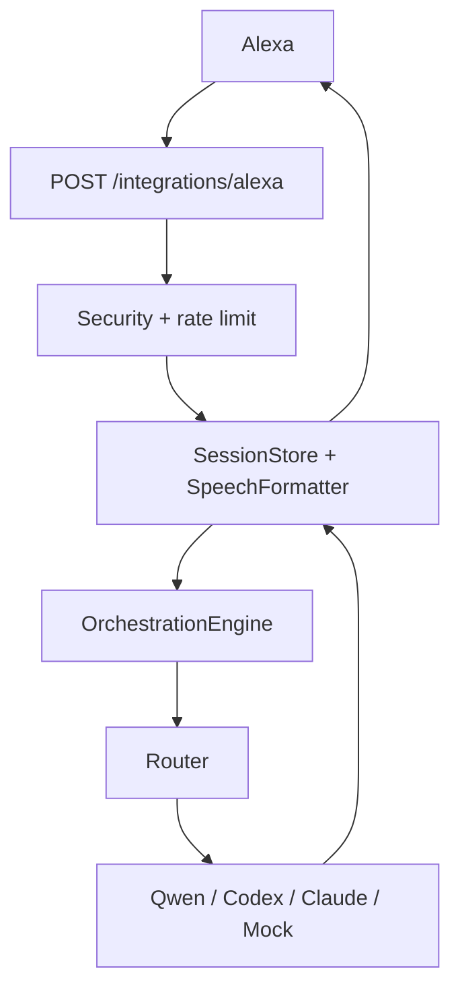

# Alexa Skill Marcelo IA

Esta integração adiciona um gateway `POST /integrations/alexa` ao IA Orquestrador. A Skill não acessa nenhum LLM diretamente: ela entrega o texto ao `OrchestrationEngine`, que mantém a decisão de agente/modelo.



## Configuração local

Copie `.env.example` para `.env`. Para desenvolvimento, `ALEXA_REQUIRE_VERIFICATION=false` permite testes locais. Em produção, use `ALEXA_REQUIRE_VERIFICATION=true`, configure `ALEXA_SKILL_ID` e publique o endpoint somente por HTTPS. O código rejeita ausência dos cabeçalhos de verificação, Skill ID divergente e timestamps antigos quando a verificação está ativa.

## Alexa Developer Console

1. Crie uma Custom Skill com idioma `Português (BR)` e invocation name `marcelo ia`.
2. Importe `alexa_model_pt-BR.json` no Interaction Model.
3. Defina o endpoint como HTTPS para `/integrations/alexa`.
4. Configure certificado HTTPS válido e o Skill ID no `.env`.
5. Faça Build Model e teste no simulador antes de usar um Echo.

## Intents

São suportados LaunchRequest, AskAIIntent, SystemStatusIntent, TaskStatusIntent, LastResultIntent, HelpIntent, CancelIntent, StopIntent e FallbackIntent. A sessão guarda somente o último pedido e a última resposta em memória; áudio bruto nunca é armazenado.

## Testes

```powershell
.\.venv\Scripts\python.exe -m pytest -q
.\.venv\Scripts\python.exe tools\test_alexa.py "Explique fibrilação atrial"
```

O mock local executa a chamada real ao fluxo configurado. Para não consumir Ollama, use os testes automatizados e substitua o serviço por mock. A Alexa tem limite de tempo de voz; `ALEXA_REQUEST_TIMEOUT` encerra a espera e retorna uma mensagem segura.

## Troubleshooting

- `401`: habilite os cabeçalhos e certificado oficiais da Alexa, e confira o Skill ID.
- `404`: verifique `ALEXA_ENABLED=true`.
- resposta lenta: confira Ollama, o modelo `qwen3:8b` e o timeout.
- nunca exponha o servidor local diretamente à internet; use HTTPS, proxy reverso, autenticação e firewall.
